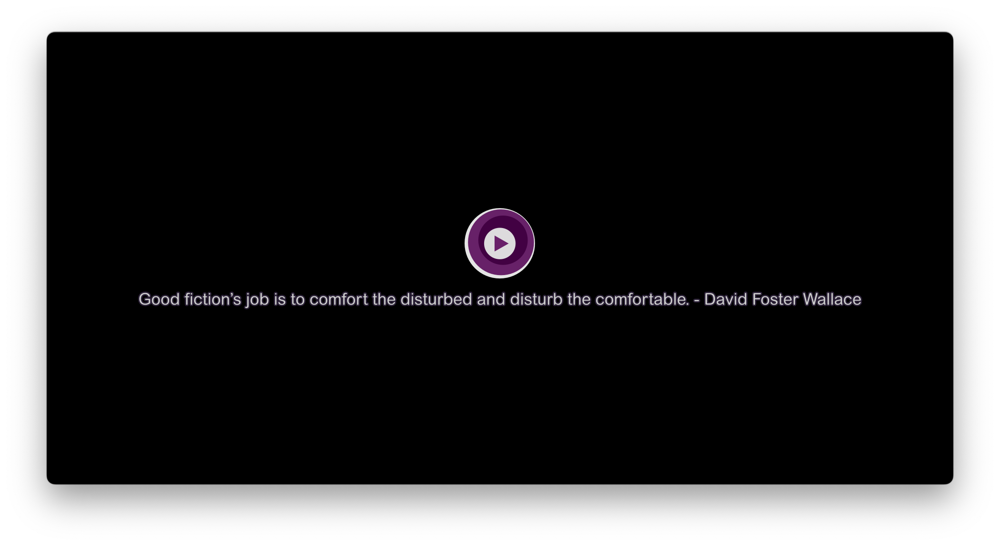

# My mpv configuration

This repository contains several [lua](http://lua.org) scripts and settings 
for [mpv](https://mpv.io). Most of lua scripts are from internet except 
`finder-integration.lua`, `copy-and-paste.lua` and `on-file-loaded.lua`.

## Installation

First [install mpv](https://mpv.io/installation/) and then download and unzip 
[this repo](https://github.com/9beach/mpv-config/archive/refs/heads/main.zip).

In Mac or Linux, run the following from the terminal. Then it will install 
`my-config` to your mpv configuration directory. Your original mpv 
configuration will be copied to `~/Downloads` directory if it exists.

```console
cd mpv-config-main 
./install.sh
```

In Microsoft Windows, run the following from the `Command Prompt` or
`PowerShell`.

```console
C:\path-to\mpv-config-main> install.bat
```

**WARNING!** My Windows machine has NVIDIA GPU installed. So if yours does not
have it. Please remove about 10 lines below `# Video` in `mpv.conf`.

## Lua scripts

### copy-and-paste.lua

This script gives mpv the capability to copy and paste file paths and URLs.

### on-file-loaded.lua

This script has two functionalities:

1. Plays even in paused state when a new file is loaded.
2. Shows OSC alwalys when an audio file is loaded.

### finder-integration.lua

This script provides two script messages:

1. `reveal-in-finder` (CTRL+f/META+f) runs explorer.exe/Finder.app/Nautilus
with playing file selected. If you want to see playing file in explorer.exe,
it will help you.
2. `touch-file` (CTRL+x/META+x) changes the mdate of playing file to current
time. If you want to mark playing file to delete later or do something else
with, it will help you.

You can edit key binddings in `input.conf`.

### modernx-and-quotes.lua

The original code is from [ModernX](https://github.com/cyl0/ModernX).

> An MPV OSC script based on [mpv-osc-modern](https://github.com/maoiscat/mpv-osc-modern/) that aims to mirror the functionality of MPV's stock OSC while with a more modern-looking interface.


I added a simple function on the original code. In idle state, it shows a qoute
about writing and art. You can copy the text (with `copy-and-paste.lua` or your
own key binding), and add your favorites to `writing-quotes` file.



### playlistmanager.lua

The original code is from [jonniek/mpv-playlistmanager](https://github.com/jonniek/mpv-playlistmanager).

> This script allows you to see and interact with your playlist in an intuitive way. The key features are removing, reordering and playing files. Additional features include resolving url titles, stripping filenames according to patterns and creating/saving/shuffling/sorting playlists.


I made a little change to the original code. Just exported two functions and
key bindings:

1. `sortplaylistbydatedesc` (CTRL+SHIFT+s/META+SHIFT+s)
2. `sortplaylistbyname` (CTRL+SHIFT+d/META+SHIFT+d)

### autoload.lua

The original code is from [mpv-player/mpv](https://github.com/mpv-player/mpv/blob/master/TOOLS/lua/autoload.lua). Nothing changed.

> This script automatically loads playlist entries before and after the the currently played file. It does so by scanning the directory a file is located in when starting playback.

### reload.lua

The original code is from [4e6/mpv-reload](https://github.com/4e6/mpv-reload). Nothing changed.

> When an online video is stuck during buffering or got slow CDN source, restarting often helps. This script provides automatic reloading of videos that didn't have buffering progress for some time, keeping the current time position while preserving entries in the playlist. It also adds Ctrl+r keybinding to reload video manually.
