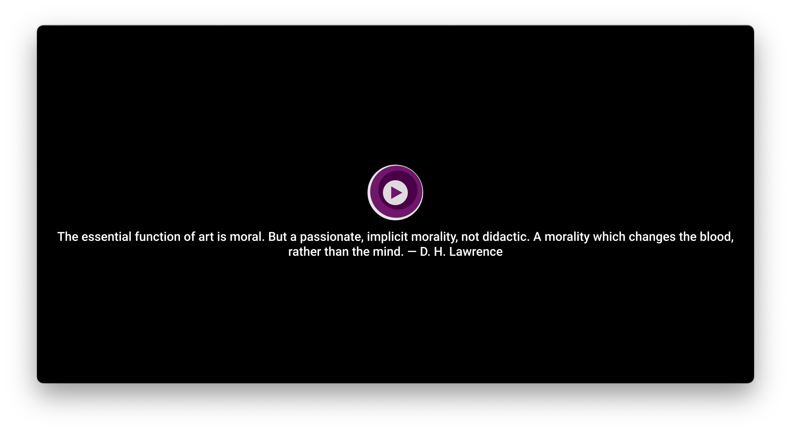

# My mpv settings

This repository contains several [Lua](http://lua.org) scripts and settings
I wrote for [mpv](https://mpv.io). Many parts in my code are from internet
obviously.

## Installation

You can install each Lua script below individually by just copying it. Please
notice that the installation script is probably just for me, and also that
subtitle settings of `mpv.conf` and `script-opts/on-file-loaded.conf` are for
Koreans. Anyhow it installs all the scripts and settings of this repository.

First [install mpv](https://mpv.io/installation/) and then download and unzip
[this repository](https://github.com/9beach/mpv-config/archive/refs/heads/main.zip).

In Mac or Linux, run the following from the terminal. Then it installs
`9beach/mpv-config` to your **mpv** configuration directory. Your original
**mpv** settings are copied to `~/Downloads` directory if it exists.

```console
cd mpv-config-main
./install.sh
```

If your machine has NVIDIA GPU installed, run `./install.sh nvidia`.

If you prefer `portable_config`, run the following.

```
MPV_CONF_PATH="path-to-my-mpv\portable_config" ./install.sh
```

In _Microsoft Windows_, run the following from the `Command Prompt` or
`PowerShell`.

```console
C:\path-to\mpv-config-main> install.bat
```

If your machine has NVIDIA GPU installed, run `install.bat nvidia`.

If you prefer `portable_config`, run the following.

```
C:\path-to\mpv-config-main> SET MPV_CONF_PATH=C:\path-to-my-mpv\portable_config
C:\path-to\mpv-config-main> install.bat
```

Notice that there are no quotation marks in `MPV_CONF_PATH` definition.

## Lua scripts

You can copy and install each script below to your **mpv** scripts directory,
which is usually `~/.config/mpv/scripts/` or `%APPDATA%/mpv/scripts/`. Please
see [https://mpv.io/manual/master/#files](https://mpv.io/manual/master/#files)
and [https://mpv.io/manual/master/#script-location](https://mpv.io/manual/master/#script-location)
for more information.

### [web-download.lua](https://github.com/9beach/mpv-config/blob/main/scripts/web-download.lua)

With this script, you can download media files of **mpv** playlist from web
sites including YouTube, Twitter, Twitch.tv, Naver, Kakao...

You can edit key bindings below in `script-opts/web-download.conf`:

- Downloads currently playing media. (`Ctrl+d, Meta+d`)
- Downloads all media of **mpv** playlist. (`Ctrl+D, Meta+D`)
- Downloads currently playing media as a audio file. (`Ctrl+e, Meta+e`)
- Downloads all media of **mpv** playlist as audio files. (`Ctrl+E, Meta+E`)

To download media files, you need to install
[yt-dlp](https://github.com/yt-dlp/yt-dlp/releases) in your system.
For _Microsoft Windows_ users, just download `yt-dlp.exe` and move it to
`C:\Windows` or `mpv.exe` directory. For _OSX_ users, run `brew install yt-dlp`.

### [copy-and-paste.lua](https://github.com/9beach/mpv-config/blob/main/scripts/copy-and-paste.lua)

This script gives **mpv** the capability to copy and paste file paths and URLs.
You can paste and play multiple lines of media file paths, media URLs, and
HTML page URLs including YouTube, Twitter, Twitch.tv, Naver, Kakao...

You can edit key bindings below in `script-opts/copy-and-paste.conf`:

- Pastes file paths or URLs in clipboard to playlist. (`Ctrl+V, Meta+V`)
- Appends file paths or URLs in clipboard to playlist. (`Ctrl+b, Meta+b`)
- Appends file paths or URLs in clipboard to current track. (`Ctrl+v, Meta+v`)
- Copies file path or URL of current track. (`Ctrl+c, Meta+c`)

For _OSX_ users, it's nice to know that when option key pressed, the context
menu of a file reveals `Copy as pathname` menu item (or just press `⌘⌥C`). You
can paste the paths of local media to **mpv** with this.

To download media files, you need to install
[yt-dlp](https://github.com/yt-dlp/yt-dlp/releases) in your system.
For _Microsoft Windows_ users, just download `yt-dlp.exe` and copy it to
`C:\Windows` or `mpv.exe` directory. For _OSX_ users, run `brew install yt-dlp`.

### [simple-playlist.lua](https://github.com/9beach/mpv-config/blob/main/scripts/simple-playlist.lua)

This script provides script messages below:

- script-message simple-playlist sort date-desc
- script-message simple-playlist sort date-asc
- script-message simple-playlist sort date-desc startover

`simple-playlist sort` also support `size-asc`, `size-desc`, `name-asc`,
`name-desc` with or without `startover`. It's quite fast. Of course,
the time complexity of my sorting algorithm is **O(nlog n)** for **Lua** data,
but for the **mpv** system call, i.e., `mp.commandv('playlist-move', i, j)`,
the time complexity is **O(n)**.

- script-message simple-playlist shuffle
- script-message simple-playlist reverse
- script-message simple-playlist show-text 5
- script-message simple-playlist show-osc 5
- script-message simple-playlist hide
- script-message simple-playlist playfirst
- script-message simple-playlist playlast
- script-message simple-playlist save

`5` in `show-text` and `show-osc` is the duration in seconds. To keep the code
simple, the playlist is not refreshed automatically, so another `show-text` or
`show-osc` is needed to refresh the playlist. You can edit key bindings in
`input.conf`.

Many parts in my code are from <https://github.com/jonniek/mpv-playlistmanager>.

### [on-file-loaded.lua](https://github.com/9beach/mpv-config/blob/main/scripts/on-file-loaded.lua)

This script provides the functions below:

- Shows OSC always when an audio file (that is of known audio extensions or
  has no video) is loaded.
- Plays even in paused state when a new file is loaded.
- Does not show subtitle if lower-case path matches given patterns.
- Does not show subtitle if audio language matches given values.

* Resets **mpv** geometry when an non-audio file (that is not of known audio
  extensions and has no video) is loaded. With this feature, **mpv** can
  escape from small rectable when a webm media has video even if `mpv.conf` has
  settings below.
  
  ```
  [extension.webm]
  geometry=800x800+100%+100%
  ```

`watch_later` setting for each file overrides subtitle visibilities above.
So if you change the visibility of subtitle in a file, **mpv** remembers it
just for that file if you resume to play it.

You can edit the settings in `script-opts/on-file-loaded.conf`.

### [finder-integration.lua](https://github.com/9beach/mpv-config/blob/main/scripts/finder-integration.lua)

This script provides two script messages:

1. `reveal-in-finder` runs explorer.exe/Finder.app/Nautilus with playing file
   selected. If you want to reveal playing file in explorer.exe, it will help
   you. (`Meta+x, Ctrl+x`)
2. `touch-file` changes the `mdate` of playing file to current time. If you
   want to mark playing file to delete later or do something else with, it will
   help you. (`Meta+f, Ctrl+f`)

You can edit the settings in `script-opts/finder-integration.conf`.

### [on-startup-shutdown.lua](https://github.com/9beach/mpv-config/blob/master/scripts/on-startup-shutdown.lua)

This script provides the functions below:

- Saves and restores sound volume level

`watch_later` setting for each file overrides sound volume level above.
So if you change the sound volume level of a file, **mpv** remembers it just
for that file if you resume to play it.

You can edit the settings in `script-opts/on-startup-shutdown.lua`.

### [modernx-and-quotes.lua](https://github.com/9beach/mpv-config/blob/main/scripts/modernx-and-quotes.lua)

The original code is from [ModernX](https://github.com/cyl0/ModernX).

> An MPV OSC script based on
> [mpv-osc-modern](https://github.com/maoiscat/mpv-osc-modern/) that aims to
> mirror the functionality of MPV's stock OSC while with a more modern-looking
> interface.


I added a simple feature. In idle state, it shows a quote about writing and art.
You can copy the text with `script-message copy-quote`, and also add your
favorite quotes to `script-opts/modernx-and-quotes.txt` file.



To install **modernx-and-quotes**, please copy `scripts/modernx-and-quotes.lua`,
`script-opts/osc.conf`, and `script-opts/modernx-and-quotes.txt` to your system.

### autoload.lua

This code is from [mpv-player/mpv](https://github.com/mpv-player/mpv/blob/master/TOOLS/lua/autoload.lua). Nothing changed.

> This script automatically loads playlist entries before and after the the
> currently played file. It does so by scanning the directory a file is located
> in when starting playback.
